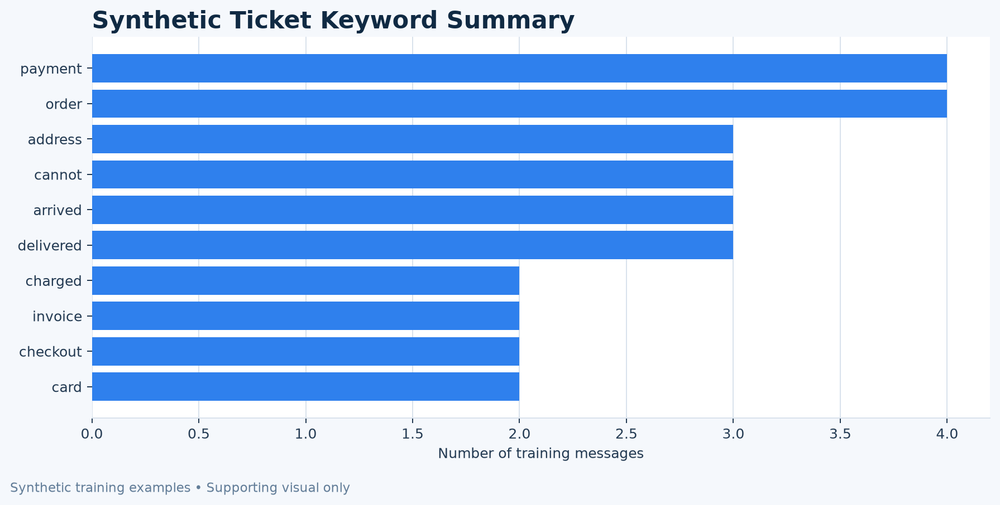

# Customer Support NLP API

Turn unstructured customer messages into structured, workflow-ready ticket data.

This portfolio demonstration combines lightweight machine learning, transparent extraction rules, and a FastAPI service. It is designed to show a realistic first layer of support-ticket automation without using a large language model or an external inference API.

## Business Problem

Customer messages often arrive as unstructured text. A support team still needs to read each message, identify the business category, find important fields, and decide whether the ticket needs urgent attention.

This service automates that first pass:

```text
Customer Message
        ↓
FastAPI NLP Service
        ↓
Category + Priority + Extracted Entities
        ↓
CRM / Helpdesk Workflow
```

## What the API Does

### Text Classification

The classifier predicts one of three support categories:

- `billing`
- `delivery`
- `technical`

The model uses a scikit-learn pipeline:

```text
TF-IDF Vectorizer → Logistic Regression
```

The training data contains 30 balanced synthetic support examples. The saved model is loaded by FastAPI and is not retrained for each request.

### Entity Extraction

Transparent regular expressions extract the first match for:

- order IDs such as `ORD-10482`;
- email addresses;
- common phone-number formats;
- monetary values such as `£49.99` or `120 USD`;
- ISO, US, and common English date formats.

The API keeps the entity schema stable. Missing fields are returned as `null`.

### Priority Rules

Priority is assigned with explicit rules:

1. high-priority phrase match → `high`;
2. otherwise medium-priority phrase match → `medium`;
3. otherwise → `low`.

If classifier confidence is below `0.70`, the response sets `needs_review` to `true`.

## Example Request and Response

Request:

```json
{
  "text": "My order ORD-10482 has not arrived. Please contact me at customer@example.com."
}
```

Response:

```json
{
  "category": "delivery",
  "priority": "high",
  "entities": {
    "order_id": "ORD-10482",
    "email": "customer@example.com",
    "phone": null,
    "amount": null,
    "date": null
  },
  "keywords": ["order", "arrived"],
  "confidence": 0.7116,
  "needs_review": false
}
```

## Endpoints

| Method | Endpoint | Purpose |
| --- | --- | --- |
| `GET` | `/health` | Check service and model loading status |
| `POST` | `/analyze` | Classify and enrich one support message |
| `GET` | `/docs` | Open FastAPI Swagger documentation |

## Run Locally

Create an environment and install dependencies:

```bash
python3 -m venv .venv
source .venv/bin/activate
pip install -r requirements.txt
```

Train the saved model and build the supporting keyword summary:

```bash
python scripts/train_model.py
```

Start the API:

```bash
uvicorn app.main:app --reload
```

Open the interactive documentation at:

```text
http://127.0.0.1:8000/docs
```

Health check:

```bash
curl http://127.0.0.1:8000/health
```

Analyze a message:

```bash
curl -X POST http://127.0.0.1:8000/analyze \
  -H "Content-Type: application/json" \
  -d '{"text":"My order ORD-10482 has not arrived. Please contact me at customer@example.com."}'
```

## Supporting Visual

The keyword chart is a small supporting view of the synthetic training examples. It is not a production analytics dashboard.



## Suitable Client Scenarios

This workflow can be adapted for:

- customer-support inbox triage;
- CRM or helpdesk pre-processing;
- order-status and billing message routing;
- extracting fields from email or contact-form submissions;
- lightweight internal ticket automation.

## Limitations

- The training data is synthetic and intentionally small.
- This demo is English-only.
- The classifier is not benchmarked for production accuracy.
- Regex extraction covers common formats, not every international variation.
- No authentication, database, queue, deployment system, or CRM integration is included.

This is a portfolio demonstration, not a real client project, production support system, or safety-critical decision service.

## Project Structure

```text
case_1_fastapi_nlp_api/
├── app/
│   ├── main.py              # FastAPI application and endpoints
│   ├── schemas.py           # Pydantic request/response models
│   ├── classifier.py        # TF-IDF + Logistic Regression lifecycle
│   ├── extractor.py         # Regex entity extraction
│   └── rules.py             # Priority and keyword rules
├── data/
│   └── training_examples.csv
├── models/
│   └── intent_classifier.joblib
├── examples/
│   ├── sample_requests.json
│   └── sample_response.json
├── outputs/
│   └── keyword_summary.png
├── portfolio/
│   └── cover.png
├── scripts/
│   └── train_model.py
├── tests/
│   └── test_api.py
├── README.md
└── requirements.txt
```
